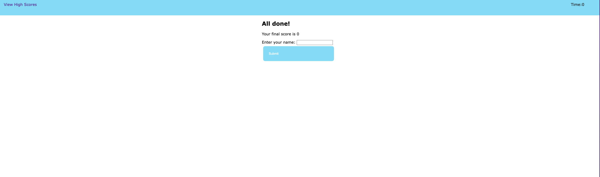
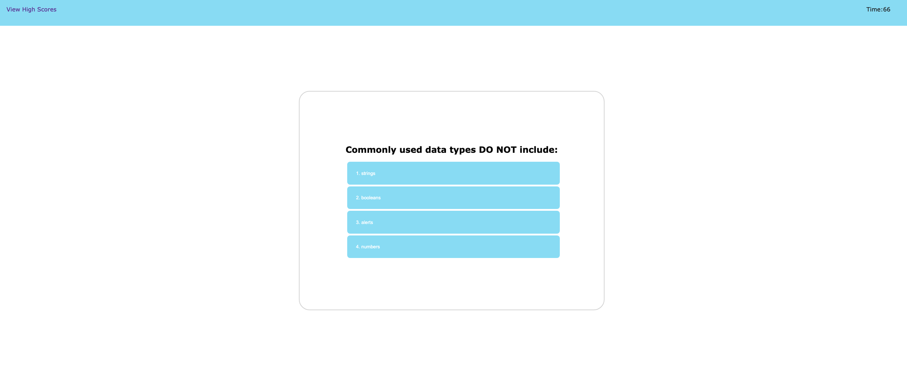
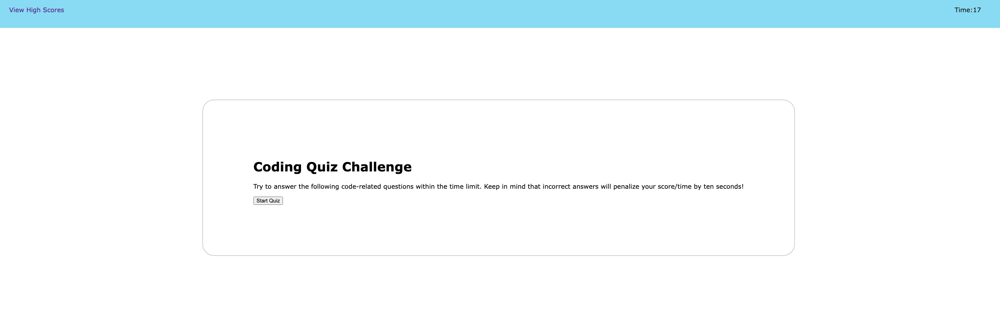

# 04-challenge-APIs
## Description
- What was your motivation?  
  To practice what I have learned in javascript so far.
- Why did you build this project? (Note: the answer is not "Because it was a homework assignment.")  
  To build a quiz challenge using what I have learned, such as array, for loop, function, object, LocalStorage, SetTimer, JASON, etc. 
- What problem does it solve?  
  It can record user's challenge scores and serve as the reference for learning progress.
- What did you learn?  
  I have learned how to practice the theory and search the information I need on internet.
## Usage
Users can go to the website and see a start quiz page. By clicking on the start button, the user will be taken to the question page. When the user click on any answer, another question will show up until the last question or time reaches 0. If the user answer the question wrong, 15 seconds will be taken away from the total time left until it reaches 0.
(https://annielawang.github.io/04-challenge-APIs/)

## Credits
Thank my teachers and classmates for their help. Thank my families for their support.
## License
MIT license.